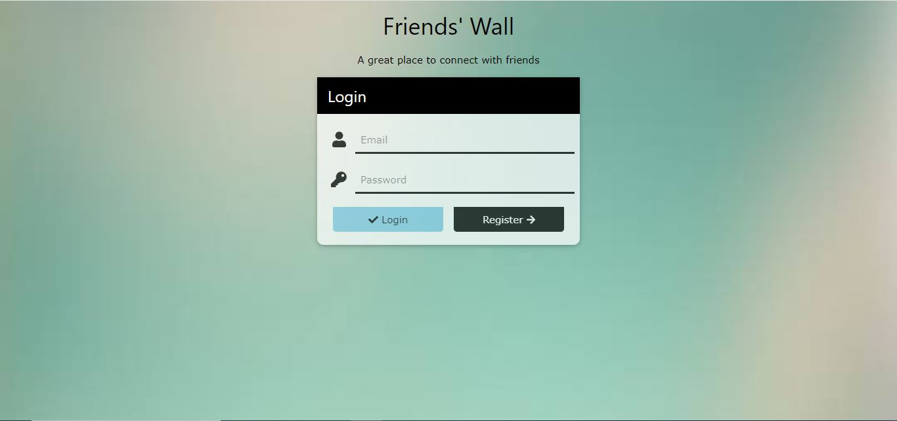
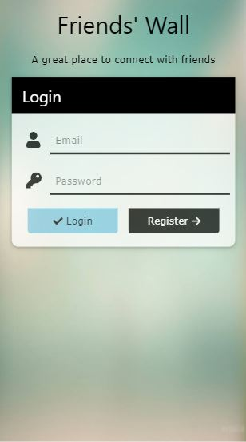
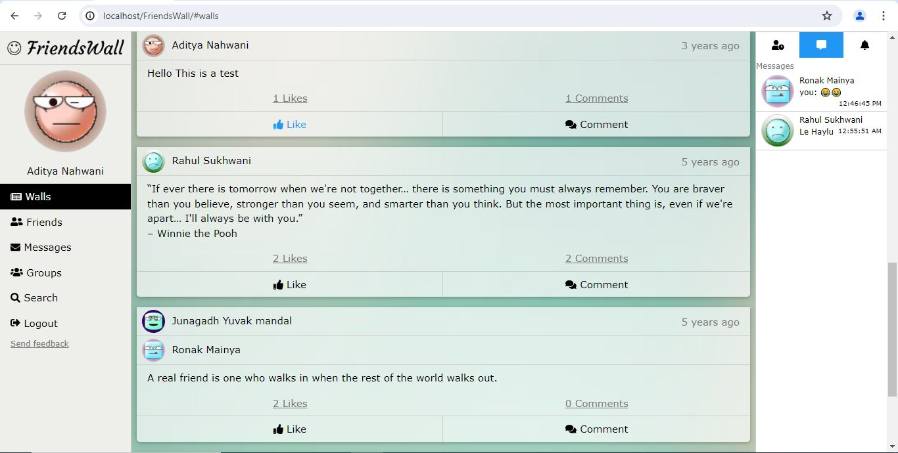
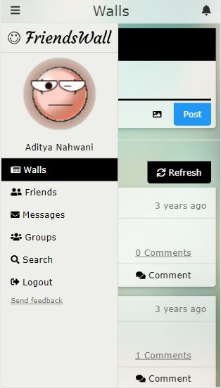
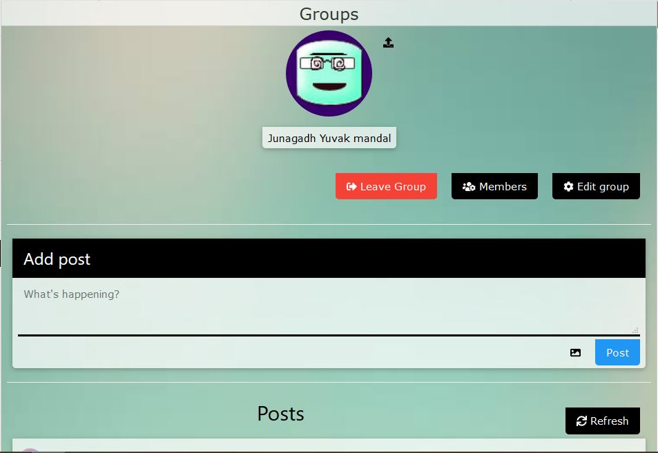

# FriendsWall

Welcome to **FriendsWall**! This project, created during my school days in 2017, is a social networking platform built using PHP, MySQL, HTML, CSS, JavaScript, JQuery, and RESTful services.

## About the Project

FriendsWall is a social networking platform where users can create profiles, post updates, send friend requests, and interact with other users' posts. This project was a great learning experience in web development and RESTful API design.

## Features

- User authentication and profile management
- Posting status updates
- Friend request system
- Commenting and liking posts
- Real-time notifications using SSE (Server-Sent Events)

## Tech Stack

- **Frontend:** HTML, CSS, JavaScript, JQuery
- **Backend:** PHP, REST
- **Database:** MySQL

## Screenshots

### Login Page

### Walls

### Groups

